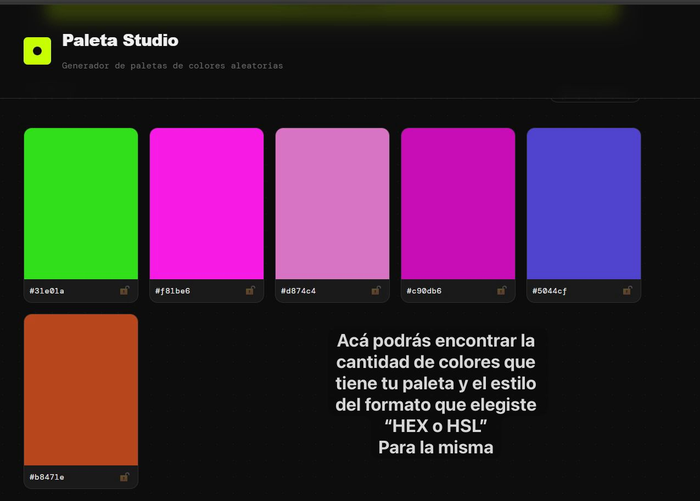
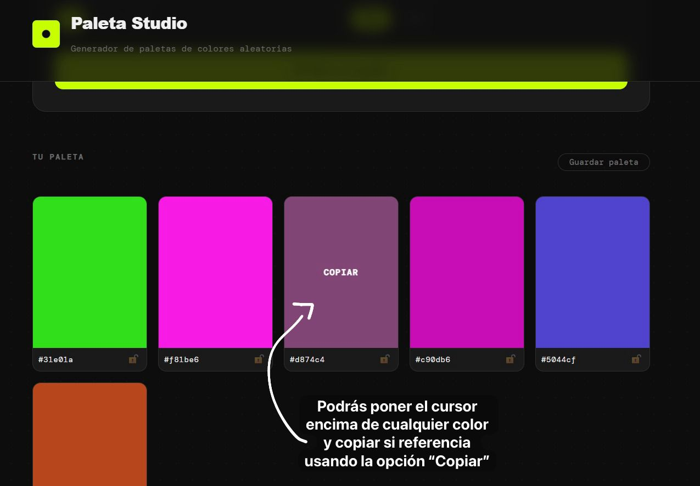
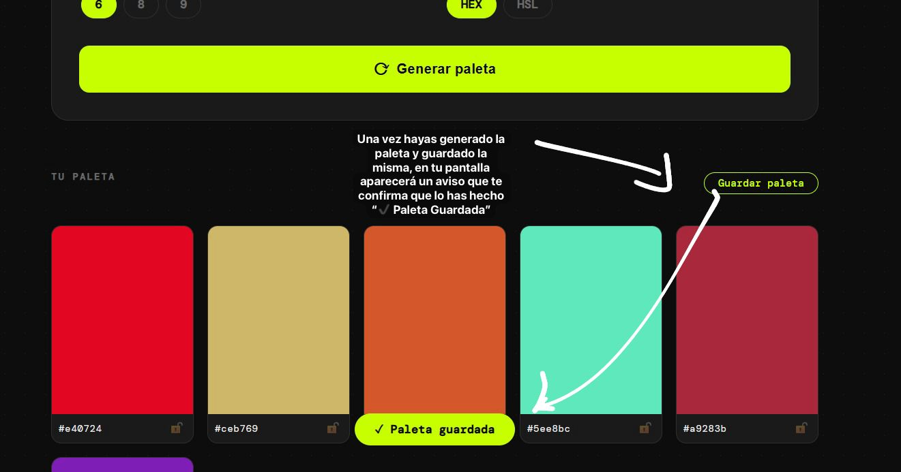
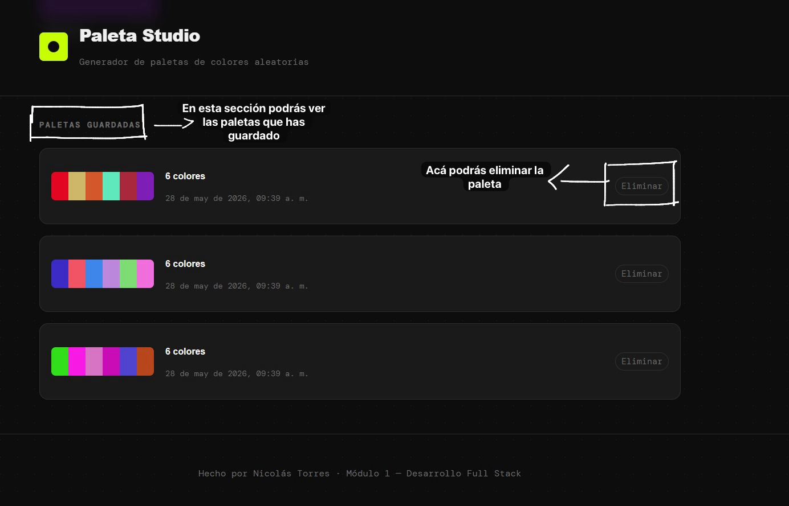

# 🎨 Generador de Paletas de Colores

Una aplicación web desarrollada con **HTML5, CSS y JavaScript** que permite generar paletas de colores dinámicas en formatos **HEX** y **HSL**.

## 🚀 Características

* Generación automática de paletas de colores
* Formatos disponibles:

  * HEX
  * HSL
* Cantidades de colores disponibles:

  * 6 colores
  * 8 colores
  * 9 colores
* Interfaz moderna y responsive
* Copiado rápido de colores
* Diseño limpio y fácil de usar

---

## 🛠️ Tecnologías utilizadas

* HTML5
* CSS
* JavaScript (Vanilla JS)

---

## 📸 Vista previa

```md







```

---

## 📂 Estructura del proyecto

```bash
📦 generador-paletas
 ┣ 📂 css
 ┃ ┗ 📜 style.css
 ┣ 📂 js
 ┃ ┗ 📜 app.js
 ┣ 📜 index.html
 ┗ 📜 README.md
```

---

## ⚡ Cómo usar el proyecto

1. Clona el repositorio:

```bash
git clone https://github.com/torresdiaznicolassantiago-spe/ProyectoM1-Nicol-s-Torres-.git
```

2. Entra en la carpeta del proyecto:

```bash
cd generador-paletas
```

3. Abre el archivo `index.html` en tu navegador.

---

## 🎯 Objetivo del proyecto

Este proyecto fue creado con el objetivo de practicar y mejorar habilidades en desarrollo frontend, especialmente en:

* Manipulación del DOM
* Generación dinámica de datos
* Diseño responsive
* Manejo de colores en JavaScript

---

## 📌 Próximas mejoras

* Exportar paletas
* Guardar favoritas
* Generar colores mediante IA
* Modo oscuro
* Compatibilidad con RGB

---

## 👨‍💻 Autor

Desarrollado por Nicolás Torres.

* GitHub: https://github.com/torresdiaznicolassantiago-spe/ProyectoM1-Nicol-s-Torres-.git

---

## 📄 Licencia

Este proyecto está bajo la licencia MIT.
